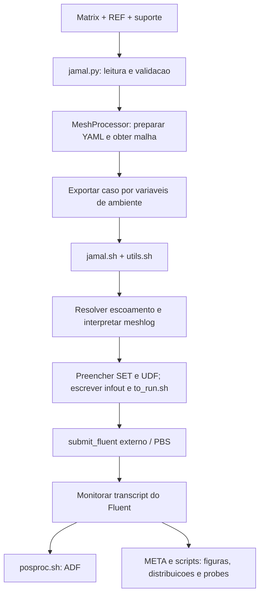

# JAMAL — requisitos para o refactor completo em Python

**Versão:** 0.1, 18/09/2026. **Estado:** documento para revisão, baseado na análise estática do pacote entregue e nas decisões do responsável pelo projeto.

O objetivo é substituir a implementação de coordenação, preparação e pós-processamento do JAMAL por um backend em Python, mantendo um JSON legível como contrato com o futuro frontend. O resultado principal continua sendo a execução das polares no Fluent e a produção do ADF.

Este documento descreve o funcionamento observado, os requisitos da substituição e uma proposta de contrato. **Comportamento encontrado no código não equivale automaticamente a comportamento aprovado.** Os exemplos de JSON são propostas de estrutura, não arquivos prontos para executar no cluster nem um schema já aceito.

## 1. Base da análise e limites

Foram examinados os pontos de entrada, validação e integração Python de `JAMAL_shell`, os scripts `jamal.sh`, `utils.sh` e `posproc.sh`, o script ANSA, o gerador de probes, o template UDF, os arquivos de suporte e de malha entregues, a matriz textual, a imagem da matriz, os testes e fixtures relevantes e os documentos anteriores em `docs`. A seção 14 identifica as fontes para rastreabilidade.

Não foram executados ANSA, Fluent, PBS ou META. Os arquivos entregues como `CARM.ansa`, `Batch_Scenario_carm.ansa` e `CARM.msh.h5` são os placeholders informados pelo usuário (o conteúdo é placeholder; os nomes foram corrigidos em 2026-09-19 — o Windows Explorer havia acrescionado `.txt` indevidamente); não demonstram validade de geometria ou de malha. O meshlog fornece evidência do formato histórico, não certifica esses placeholders. O pacote não inclui a implementação de `submit_fluent` nem um ADF de referência completo para homologação.

As classificações utilizadas são:

| Marca | Significado |
|---|---|
| Confirmado | Decisão explícita do usuário ou ADR aceito, preservada nesta análise. |
| Observado | Comportamento ou dependência identificado no código entregue; não é prova de execução bem-sucedida. |
| Proposto | Requisito ou desenho recomendado para a substituição; sujeito à revisão deste documento. |
| Em aberto | Decisão necessária para fechar determinado contrato, sem impedir a documentação das demais partes. |

Os identificadores `RP-*` abaixo pertencem a esta proposta; não renumeram os `FR`, `QA`, `OP`, `UX` e `DC` dos rascunhos anteriores. A seção 13 explicita onde esses rascunhos precisam ser conciliados com a evidência atual.

## 2. Decisões confirmadas e fronteira do produto

1. O frontend será desenvolvido depois. Interpretação da matriz, leitura/autoria de REF e interface gráfica ficam antes do JSON. O backend não depende da existência desses arquivos.
2. Um JSON representa uma simulação/polar e pode conter uma varredura. Quantidades de referência, condições de voo, geometria e parâmetros de malha chegam pelo JSON; o backend calcula as condições físicas derivadas.
3. ANSA continua sendo o gerador de malha. Seu script atual e a interface YAML são mantidos nesta etapa; o backend adapta o JSON e prepara os arquivos necessários. Transformações e morphing continuam executados pelo ANSA.
4. Fluent é o solver desta etapa; o ambiente operacional é Linux/HPC com PBS e LMOD. SU2 fica fora da entrega funcional, mantendo-se uma separação que permita outro adaptador no futuro.
5. No sweep WARM, os pontos de cada ramo continuam da solução corrente, na mesma sessão do Fluent. Para α de −10° a +20°: calcular/salvar 0°, executar +1°…+20°, recarregar 0° e executar −1°…−10°.
6. Cada **ponto efetivamente calculado** executa todas as iterações especificadas. Não há avanço antecipado nem bloqueio dos demais pontos por critério de convergência nesta etapa. Convergência do solver permanece adiada.
7. Uma polar pode depender da solução salva de um ponto de outra polar. A dependência é liberada quando esse ponto está disponível, sem esperar o fim da polar inteira.
8. **Confirmação adicional de 18/09/2026:** a POLAR 003 reutiliza o ponto α=0°, β=0° da POLAR 002 **sem novas iterações nesse ponto**. Seu primeiro ponto calculado é β=1°. O ponto reutilizado pertence aos resultados da POLAR 003, com sua origem registrada. Essa reutilização não contradiz a regra de iterações dos pontos calculados.
9. Os templates UDF `.c` devem ser preenchidos com os valores do caso. Não se está solicitando a criação de novos algoritmos UDF.
10. Um pós-processador dedicado produz o ADF com três coeficientes de força e três de momento em **cada** sistema de eixos: corpo, vento e estabilidade. Figuras, Cp e distribuições de carga são opcionais.
11. Permanecem as decisões de isolamento de execuções, cache de malha compartilhado e imutável com symlinks, retomada por etapas usando estado e artefatos, journal gerado sem SET obrigatório, e mecanismos explícitos de injeção e supressão de comandos.

“Refactor completo em Python” significa substituir o núcleo e os fluxos de `jamal.sh`, `utils.sh`, `posproc.sh` e a ponte por variáveis de ambiente. Journals Fluent, scripts de job PBS, UDFs C, YAML de integração e scripts executados dentro de ferramentas continuam sendo artefatos necessários. O script ANSA já é Python, mas sua reescrita permanece fora desta etapa por decisão anterior.

## 3. Como o JAMAL entregue funciona

### 3.1 Fluxo principal



O pacote é híbrido: Python já lê e valida a matriz e cobre parte da preparação da malha; Bash ainda concentra o planejamento do solver, condições físicas, arquivos, submissão e ADF. Reescrever apenas `jamal.py` deixaria a maior parte do fluxo antigo intacta. [S01–S08]

| Etapa observada | Entradas e comportamento | Saídas/dependências |
|---|---|---|
| Seleção e validação | A matriz fornece flags, identidade, configuração, controles, propulsão, REF/SET, solver, recursos, iterações e condições. Linhas desativadas são ignoradas; validações vêm também de `etc/jamal.yml`. | Objetos `SimulationCase`; metadados do REF. |
| Malha pela rota Python | Para a rota YAML, combina geometria, transformações, morphing e controles; escreve `ansa_config.yaml`; carrega módulo e invoca ANSA. | Diretório `Fluent_Meters_*`, `.msh.h5` e `.ansa.meshlog`. |
| Ponte Python/Bash | Serializa listas e valores em variáveis de ambiente e executa `jamal.sh`. | Dependência implícita de nomes, formatos e contexto do processo. |
| Preparação Bash | Também possui rotas antigas de malha, malha existente, múltiplas malhas e solução de outra polar; lê REF e SET; cria symlinks e diretórios. | `02-RUNS/POLAR-*`, SET preenchido, UDFs, `infout`. |
| Escoamento e BCs | Resolve altitude/Re, Mach/velocidade e propriedades; interpreta zonas do meshlog; configura farfield, paredes, simetria e modos de propulsão. | Valores físicos e comandos Fluent. |
| Planejamento de pontos | WARM continua solução; COLD/múltiplas malhas têm ramificações próprias. Os modos CL/CY usam `coef_driver.c`. | Journals, gravação de case/data e relatórios por ponto. |
| Submissão | Escreve `to_run.sh` com chamadas a `submit_fluent`, incluindo CPUs, walltime, precisão/dimensão e versão. | Job externo; a implementação que traduz isso para PBS não foi entregue. |
| Monitoramento | Uma função observa o transcript e dispara pós-processamento ao encontrar `Transcript Stop Time:`. | Não constitui, sozinha, confirmação do scheduler nem de todos os pontos. |
| Pós-processamento | Lê `infout`, FORCE/MOMENT e, em modos CL/CY, `albe.out`; normaliza e transforma coeficientes. | ADF total e por grupos; produtos opcionais dependem de ferramentas adicionais. |

Os modos de job expostos são `0` preparar, `1` submeter e `2` submeter/monitorar/pós-processar. Na implementação entregue, `MeshProcessor` é chamado antes da distinção desses modos: preparar pode envolver ANSA. O contrato novo deverá separar validação, preparação com ferramentas e submissão com nomes inequívocos. [S01, S04, S05]

### 3.2 Estrutura de arquivos observada

```text
JAMAL_Struct_Folders/
  matrixpy
  00-SUPPORT/
    REF-001
    SET-050, SET-055
    coef_driver.c, udf.h
    probe_coords_1.dat
    prep_drag_rise.sh
  01-GRIDS/
    ANSA/
      CARM.ansa                           [dummy]
      ansa_config_template.yaml
      ansa_config.yaml
      01-BATCH/Batch_Scenario_carm.ansa    [dummy]
    Fluent_Meters_CARM/
      CARM.msh.h5                         [dummy]
      CARM.ansa.meshlog
  02-RUNS/POLAR-*/                        [criado pelo pipeline]
  03-RESULTS/                             [destino dos resultados]
```

Há um template genérico e um YAML resolvido para uma variante CARM; a matriz referencia também templates numerados e outras geometrias que não foram entregues. Não se deve inferir o conteúdo desses arquivos ausentes. As linhas da matriz textual estão desativadas (`RUN=0`). O objetivo aqui é descrever o contrato e os cenários, não executar essa matriz. [S10, S12]

O REF fornecido contém SREF=2,231 m², CREF=0,500 m, BREF=2,786 m e centro de momentos [1,598; 0; 0] m, além de definições de controles e propulsor. Esses dados passam a ter representação explícita no JSON. SET-050 e SET-055 diferem em escolhas numéricas, incluindo a família density-based/pressure-based; portanto, sua substituição exige receitas numéricas documentadas, não apenas um campo de turbulência. [S11]

### 3.3 Exemplo confirmado: POLAR 002 e POLAR 003

| Polar | Pontos desejados | Origem | Sequência operacional |
|---|---|---|---|
| 002 | α=−10…20°, passo 1°; β=0°; Mach=0,2; altitude=0 ft | Geometria + parâmetros de malha | Calcular 0; salvar; calcular +1…+20; recarregar 0; calcular −1…−10. |
| 003 | β=0…15°, passo 1°; α=0°; mesmas condições de voo | Ponto α=0°, β=0° da 002 | Aguardar publicação; reutilizar β=0 sem iterar; calcular β=1…15 continuando a solução. |

A 002 contém 31 pontos distintos calculados. A 003 contém 16 pontos de resultado: um reutilizado e 15 calculados. Recarregar 0 na 002 não cria outro ponto nem uma segunda linha no ADF. Os exemplos da matriz também iniciam polares a partir de α=5° e α=10°; a dependência deve identificar qualquer ponto solicitado, sem regra especial restrita a α=0°. [S05, S06, S10]

O triplo legado `KNITERS=3:0.1:1` é separado em três valores. No caminho convencional de α/β, o shell utiliza o primeiro e o terceiro multiplicados por 1000: 3000 iterações no primeiro ponto calculado de uma solução nova e 1000 nos seguintes. Não foi encontrada aplicação do elemento intermediário nesse caminho. A descrição textual de `KNITERS` sugere uma semântica mais geral do que o código efetivamente aplica; ela não deve ser copiada para o novo contrato. UDFs têm parâmetros próprios de atualização e transição. [S02, S06, S09]

## 4. Escopo de substituição e prioridade

Nos requisitos abaixo, **Núcleo** é necessário para o primeiro fluxo completo confirmado. **Paridade** cobre funcionalidades presentes no legado que precisam ser implementadas e homologadas antes de declarar a substituição completa para esses usos. **Opcional** significa que o produto pode ser desligado por caso, não que a falha de uma solicitação explícita possa ser escondida. Todos os itens são requisitos propostos, exceto quando sua origem é uma decisão já confirmada.

| Capacidade | Entrega |
|---|---|
| JSON, definições físicas, malha ANSA/existente, WARM α/β, ponto de origem, journal, PBS, ADF, estado/retomada | Núcleo. |
| Controle de superfícies, transformações/morphing, Mach/velocidade e Reynolds, CL/CY via UDF, propulsão, COLD, 2D e múltiplas malhas | Paridade por cenários; não remover silenciosamente esses usos durante a migração. Alguns limites ainda precisam ser fechados. |
| Figuras, Cp, cargas distribuídas e probes | Selecionáveis; não são pré-requisito para produzir um ADF válido. |
| Frontend, parser da matriz/REF, nova GUI, SU2, novos algoritmos UDF, reescrita ANSA | Fora desta etapa. |
| Avaliar convergência CFD ou continuar o saldo de iterações de um ponto interrompido | Adiado por decisão do usuário. Retomada por etapas continua obrigatória. |

## 5. Requisitos funcionais

### 5.1 Entrada, validação e identidade

| ID | Entrega | Requisito e critério de aceite | Origem |
|---|---|---|---|
| RP-IN-01 | Núcleo | Consumir um JSON por polar sem ler matriz ou REF. Um caso com as definições equivalentes ao REF-001 deve alcançar o planejamento apenas com JSON, configuração de instalação e artefatos referenciados. | Confirmado; FR-001/ADR-0007. |
| RP-IN-02 | Núcleo | Validar JSON, versão de schema, tipos, limites e relações entre campos antes de ferramentas caras. Rejeitar chaves desconhecidas, chaves duplicadas, números não finitos e modos contraditórios; informar arquivo e caminho do campo. | FR-002/005; S02. |
| RP-IN-03 | Núcleo | Usar números/booleanos/listas/objetos reais e nomes de domínio. Não exigir strings `-`, colchetes para selecionar modos, tripletos separados por `:` ou flags numéricas sem significado explícito. | Legibilidade solicitada; S02, S10. |
| RP-IN-04 | Núcleo | Identificar campanha, polar, execução e ponto separadamente. A polar mantém a regra existente de quatro dígitos com sufixo alfanumérico opcional; duplicatas na campanha falham. IDs de ponto não podem depender apenas de Mach/Re/ângulos arredondados em nomes de arquivo. | UX-002; S06. |
| RP-IN-05 | Núcleo | Suportar casos desativados, execução e nova tentativa explícita. Não modificar o JSON de entrada para representar andamento; emitir estado separado. Reexecução deve gerar nova tentativa sem apagar resultados válidos nem o cache compartilhado. | OP-002; proposta de semântica segura. |
| RP-IN-06 | Núcleo | Declarar unidades nos campos dimensionais; converter para SI internamente. Não aceitar simultaneamente duas representações da mesma grandeza. Referências geométricas, áreas, comprimentos e convenções de eixos devem ser verificáveis. | C-06, UX-001; S11, S12. |
| RP-IN-07 | Núcleo | Resolver caminhos relativos a uma base documentada, independentemente do diretório de invocação. Confirmar existência e tipo dos arquivos exigidos pela etapa; uma solução de origem ainda em produção vira dependência pendente, não arquivo inválido imediato. | QA-001; S04, S05. |
| RP-IN-08 | Núcleo | Admitir apenas uma variável varrida por polar: α, β, Mach/velocidade ou alvo CL/CY. As demais permanecem fixas. Intervalos/listas devem produzir pontos inequívocos, com extremos e política de ordem documentados. | FR-006; S02. |
| RP-IN-09 | Paridade | Definir controles, vetores/eixos de transformação, grupos, propulsores e BCs por identidade, validando referências, unidades e cardinalidade. Um nome ausente falha antes da emissão do journal. | FR-008/009/026; workshops; S11. |

### 5.2 Atmosfera e condições de escoamento

| ID | Entrega | Requisito e critério de aceite | Origem |
|---|---|---|---|
| RP-FL-01 | Núcleo | Resolver por ponto T, p, ρ, μ, velocidade do som, Mach/velocidade, Reynolds, pressão dinâmica e grandezas de estagnação requeridas. Persistir valores, unidades, referência de comprimento e perfil de constantes utilizado. | S05, S06; FR-012/015. |
| RP-FL-02 | Núcleo | Aceitar Mach + altitude + desvio ISA e Mach + Reynolds + CREF + desvio ISA; contemplar velocidade + altitude na paridade. Rejeitar velocidade + Reynolds enquanto não houver contrato físico aprovado para esse modo. | FR-007/014; S02, S06. |
| RP-FL-03 | Núcleo | Limitar o modelo ISA ao intervalo aprovado de 0–20 km. A inversão por Reynolds deve ter domínio, limite de iterações, diagnóstico de impossibilidade e fechamento relativo de Re < 10⁻⁶, conforme requisito anterior. Não confundir essa checagem numérica com convergência CFD adiada. | FR-014, DC-010; S06. |
| RP-FL-04 | Núcleo | Centralizar constantes e equações; utilizar a mesma lei de viscosidade na resolução de escoamento e no material Fluent. Testar fronteira de 11 km, desvio ISA e conversões de unidade contra uma referência física aprovada. | FR-027, DC-007; discrepâncias S06. |
| RP-FL-05 | Núcleo | Definir explicitamente o significado de altitude e a aplicação de desvio ISA antes da homologação da atmosfera. Até essa decisão, não considerar os valores do shell nem as equações antigas de SPECS como verdade validada. | Conflito identificado; seção 13, D01. |

### 5.3 Geometria, ANSA e reutilização de malhas

| ID | Entrega | Requisito e critério de aceite | Origem |
|---|---|---|---|
| RP-ME-01 | Núcleo | Distinguir três origens: gerar com ANSA, usar malha existente e herdar malha de solução salva. Apenas a primeira invoca geração; a terceira não remalha. | Confirmado; S04, S05. |
| RP-ME-02 | Núcleo | Converter o contrato JSON para o YAML completo esperado pelo script ANSA atual, com unidades, limites, caminhos e versão explícitos. Arquivar o YAML efetivo; não depender de alterações manuais posteriores. | ADR-0007; S04, S07, S12. |
| RP-ME-03 | Núcleo | Executar ANSA em workspace isolado, incluindo seus caminhos relativos de saída e auxiliares mutáveis. Não compartilhar `ansa_config.yaml`, meshlogs, `params.ansa_mpar` ou batch inputs modificáveis entre execuções. | ADR-0001; S04, S07. |
| RP-ME-04 | Núcleo | Construir chave de cache a partir do conteúdo de geometria/batch, parâmetros efetivos, operações e versões relevantes. Nome legível é um rótulo; não substitui a identidade por conteúdo. Dois casos com a mesma receita compartilham a malha válida por symlink. | ADR-0001; falhas potenciais S04. |
| RP-ME-05 | Núcleo | Serializar a criação da mesma chave e publicar a malha apenas ao concluir sua validação. Diretório existente, arquivo parcial ou ausência de mensagem de erro não significam sucesso. Falha não publica entrada válida no cache. | QA-008; S04. |
| RP-ME-06 | Núcleo | Entregar metadados normalizados com dimensão, unidades, zonas/IDs/papéis, geometria/receita, resultado dos checks exigidos e proveniência. O domínio e o builder não devem interpretar texto de log diretamente. O produtor desses metadados permanece uma decisão de integração, D02. | FR-016/019; S07, S12. |
| RP-ME-07 | Paridade | Mapear operações de transformação/morphing e controles para o contrato real do script retido. Rejeitar operações, cardinalidades ou valores que ele não represente, em vez de truncar listas ou frações silenciosamente. | S04, S07; seção 8. |
| RP-ME-08 | Paridade | Para malha por ângulo, associar cada ponto à sua malha e registrar em que eixos a geometria está orientada. Validar a correspondência e impedir dupla rotação no pós-processamento. Suporte a sliding mesh depende de cenário Fluent homologado, não apenas de opção no ANSA. | S05–S08; D06. |
| RP-ME-09 | Núcleo | Separar condições usadas no dimensionamento da malha das condições de voo da polar. Alterar Reynolds de projeto da malha muda sua chave; alterar somente uma condição de voo não força remalha, salvo regra explícita da receita. | `wrey`, `wlref`, `wypls` em S07, S12. |

### 5.4 Planejamento, sweeps e dependências

| ID | Entrega | Requisito e critério de aceite | Origem |
|---|---|---|---|
| RP-SW-01 | Núcleo | Materializar antes da submissão um plano de pontos, ordem, ação de inicialização, malha, origem da solução e iterações. Separar ordem de execução da ordem de apresentação dos resultados. | FR-030/032; S05, S08. |
| RP-SW-02 | Núcleo | Executar o exemplo α=−10…20 como 0, +1…+20, reload 0, −1…−10 em uma sessão; não reinicializar entre pontos do mesmo ramo nem iterar novamente no reload. | Confirmação; ADR-0008. |
| RP-SW-03 | Núcleo | Receber contagens inteiras de iterações, com regra explícita para primeiro ponto calculado, seguintes e overrides por ponto. Desabilitar avanço antecipado por convergência; nenhum critério de qualidade CFD condiciona o próximo ponto nesta etapa. | Confirmação; FR-031. |
| RP-SW-04 | Núcleo | Reutilizar o ponto inicial fornecido por outra polar sem novas iterações. Preservar seus resultados/proveniência no destino; registrar `reused` e zero iterações adicionais, sem apresentá-lo como recalculado. | Confirmação adicional; S05. |
| RP-SW-05 | Núcleo | Esperar o ponto de origem completo e publicado, não o fim de seu job. No exemplo, a 003 pode iniciar quando 002/α0 está pronto, enquanto a 002 continua seus pontos positivos. | FR-032; confirmação. |
| RP-SW-06 | Núcleo | Verificar compatibilidade da origem: identidade exata da execução/ponto, geometria/malha, dimensão, solver/formato, modelos/UDFs e condições que definem o ponto reutilizado. Rejeitar correspondência ambígua ou incompatível, sem escolher arquivo por nome aproximado. | Proposto a partir de S05. |
| RP-SW-07 | Núcleo | Detectar ciclos e origens ausentes no grafo. Se a origem falhar antes de publicar o ponto, marcar dependentes bloqueados com motivo; permitir andamento dos independentes. Artefato já publicado e válido não depende do sucesso dos pontos posteriores. | Proposto; FR-032, QA-001. |
| RP-SW-08 | Núcleo | Não acrescentar um ponto zero ausente do pedido nem reordenar listas silenciosamente. Fechar política para intervalos de um só sinal, β negativo, listas e Mach antes de homologar esses cenários; tornar a política visível no plano. | Casos em S05; D03. |
| RP-SW-09 | Paridade | Representar COLD como inicialização independente e explicitar quantas sessões/jobs serão criados. Não aplicar a regra WARM de uma sessão a um modo que requer malhas ou inicializações independentes. | S05, S06. |
| RP-SW-10 | Opcional | Probes não podem introduzir iterações ocultas. A integração atual acrescenta 200 iterações; a substituição deve incluir a amostragem no orçamento declarado ou expor uma fase adicional explicitamente configurada e contabilizada. | S06, S09; D06. |

### 5.5 Fluent, BCs, receitas e UDF

| ID | Entrega | Requisito e critério de aceite | Origem |
|---|---|---|---|
| RP-SO-01 | Núcleo | Gerar journal completo sem exigir um SET legado. A receita deve especificar solver numérico, dimensão, precisão, turbulência, discretização, inicialização, monitores e gravações; nenhum placeholder pode restar. | ADR-0003; S05, S06, S11. |
| RP-SO-02 | Núcleo | Versionar receitas que preservem os comportamentos necessários de SET-050/055. Configurar versões de Fluent/módulos externamente e verificar as combinações suportadas; não aceitar um modelo só porque consta de um enum. | S02, S06, S11. |
| RP-SO-03 | Núcleo | Associar BCs por grupos declarados e metadados validados, garantindo paredes, farfield, fluido e simetria requeridos. Não depender de prefixos como `w.` ou `b.` embutidos no domínio. | S05; FR-025/026. |
| RP-SO-04 | Núcleo | Gerar direção do escoamento a partir de α/β e da convenção de eixos aprovada. Salvar solução e relatórios por ponto com sua identidade; não confundir a orientação de uma malha rotacionada com ângulo a aplicar de novo. | S06. |
| RP-SO-05 | Núcleo | Permitir snippets em hooks documentados, overrides nomeados, supressão identificada de comandos e arquivos adicionais. Registrar a composição efetiva; alvo ou arquivo inexistente deve falhar. Não inserir comandos por número de linha. | ADR-0003, DC-008. |
| RP-SO-06 | Paridade | Preencher templates UDF em diretório do caso, preservar os originais, auditar substituições e gerar compile/load/hooks coerentes. CL/CY e MFR ativos exigem seus artefatos; caso sem UDF não deve tentar compilá-las. | Confirmado; FR-024; S06, S09. |
| RP-SO-07 | Paridade | Para alvos CL/CY, registrar alvo e valor atingido, α/β resultantes e parâmetros do controlador. Tolerância do controlador não equivale a aprovação de convergência CFD nem autoriza reduzir o orçamento de iterações. | S09; confirmação sobre iterações. |
| RP-SO-08 | Paridade | Descrever propulsores por geometria/normal/área e condições físicas, e fan inlet, fan outlet e core exhaust por entidades nomeadas e variáveis com unidade. Preservar as BCs necessárias de vazão, pressão/temperatura total e pressure jump por cenários validados. | FR-026; S05, S06, S11. |

### 5.6 Execução, PBS, estado e retomada

| ID | Entrega | Requisito e critério de aceite | Origem |
|---|---|---|---|
| RP-EX-01 | Núcleo | Oferecer validar/planejar sem ferramentas, preparar sem submeter Fluent, submeter e submeter/monitorar/pós-processar; também status, retomada e pós-processamento isolado. Informar quais ferramentas a preparação poderá executar. Nomes de CLI permanecem proposta. | OP-001/004; S01. |
| RP-EX-02 | Núcleo | Submeter via adaptador PBS com recursos e ambiente configurados; armazenar ID real do job, comando, recursos e resposta. `submit_fluent` pode ser adaptado se mantido pelo site, mas não é o contrato do domínio. | OP-005; S05; D07. |
| RP-EX-03 | Núcleo | Distinguir preparado, submetido, em fila, executando, terminado, falho, cancelado e bloqueado. Consultar scheduler e artefatos; presença de `Transcript Stop Time:` isoladamente não aprova um caso. | QA-009; S06. |
| RP-EX-04 | Núcleo | Persistir estado por etapa/tentativa e artefatos associados; reconciliar depois de interrupção. Não reenviar job ativo conhecido. Se a submissão ocorreu mas sua confirmação foi perdida, reconciliar antes de repetir para evitar jobs duplicados. | ADR-0002; proposto. |
| RP-EX-05 | Núcleo | Retomar a última etapa incompleta sem repetir etapas válidas. Pós-processar novamente não deve recalcular o solver. Não prometer retomada do saldo de iterações de um ponto interrompido nesta fase. | ADR-0002/0008. |
| RP-EX-06 | Núcleo | Registrar comando, ambiente relevante, versão, stdout/stderr, código de saída e limites de espera de ferramentas. Isolar LMOD em subprocessos; falha não deve alterar o ambiente do processo principal. | QA-003/007; S04. |
| RP-EX-07 | Núcleo | Agregar sucesso, falha, desativação, pendência e bloqueio por caso, com motivos e código de saída coerente. Continuar casos independentes por padrão; opção fail-fast não apaga resultados já válidos. | QA-006, OP-006; S01. |
| RP-EX-08 | Núcleo | Usar work roots únicos e publicações atômicas de estado/artefatos. Não apagar symlinks ou arquivos que o manifesto da tentativa não identifica como próprios; não alterar a matriz nem templates compartilhados. | ADR-0001; riscos S04–S06. |

### 5.7 Pós-processamento e resultados

| ID | Entrega | Requisito e critério de aceite | Origem |
|---|---|---|---|
| RP-PP-01 | Núcleo | Disponibilizar pós-processador Python dedicado, invocável também depois da execução. Consumir plano/metadados e relatórios identificados por ponto, produzir ADF e manifesto de resultados; falhas devem ser comunicadas ao orquestrador. | Confirmado; FR-028; S08. |
| RP-PP-02 | Núcleo | Calcular seis coeficientes em cada eixo corpo/estabilidade/vento, usando forças, momentos, q e referências do ponto correto. Não usar a última condição nominal da polar para normalizar todos os pontos de um sweep de Mach. | S08; requisito físico. |
| RP-PP-03 | Núcleo | Documentar sinais, eixos, ordem de rotações, centro dos momentos, comprimentos de normalização e tratamento de simetria. Aplicar a convenção aprovada de meia área de referência para malha simétrica; registrar área original e efetivamente usada. | FR-025; S06, S08, S09. |
| RP-PP-04 | Núcleo | Incluir cada ponto uma vez, inclusive pontos reutilizados, com ordenação de apresentação declarada. Não preencher lacunas com zeros. Falta de relatório obrigatório impede declarar o ADF completo; saída parcial, se oferecida, deve ser marcada como tal. | S08; QA-001. |
| RP-PP-05 | Paridade | Produzir ADF total e por grupos/componentes solicitados, com seleção de zonas configurável e sem dupla contagem. Preservar ou versionar explicitamente o contrato usado pelos consumidores existentes. | S08, S13; D05. |
| RP-PP-06 | Opcional | Executar figuras, Cp e distribuições de carga somente quando solicitados e quando suas dependências estiverem disponíveis. Falha opcional deve ser reportada separadamente do ADF, sem destruir o resultado principal válido. | Confirmado; S08. |
| RP-PP-07 | Opcional | Explicitar entradas, localização de probes, grandezas e destino de amostras; distinguir probes no Fluent de extrações posteriores via META. Registrar iterações de amostragem quando existirem. | S08, S09. |

## 6. Proposta de JSON legível

### 6.1 Princípios do contrato

O JSON deve expressar o pedido de engenharia, enquanto um segundo artefato registra sua interpretação completa. Não se recomenda publicar `case1.json` do pacote como nova interface: ele reproduz nomes/posições da matriz, placeholders e detalhes da ponte legada.

São propostas três representações distintas:

| Artefato | Responsabilidade |
|---|---|
| JSON de entrada | Pedido do usuário, estável e legível; nunca usado como arquivo mutável de status. |
| `case.resolved.json` e `plan.json` | Valores convertidos, defaults/receitas resolvidos, hashes, pontos, ordem, dependências e parâmetros efetivos. Gerados pelo backend. |
| `state.json` e manifestos de artefatos/resultados | O que ocorreu, quais jobs e arquivos existem, quais pontos foram calculados/reutilizados e por qual tentativa. |

Manter `schema_version`, usar indentação e ordem estável para leitura e reservar `description` para notas. JSON não possui comentários. Campos opcionais não aplicáveis são omitidos ou representados por listas vazias conforme schema; `null` precisa ter semântica definida e não substitui um número obrigatório. Versões incompatíveis devem ser rejeitadas explicitamente.

Os nomes abaixo são **propostos**. A opção de campos em inglês conserva a linguagem habitual das ferramentas e evita acentos no contrato, com documentação em português. A forma exata dos nomes, enums e agrupamentos ainda será validada antes do código de produção.

| Seção | Conteúdo |
|---|---|
| `identity`, `enabled`, `description` | Campanha, polar, seleção e explicação humana. `run_id` é atribuído à execução. |
| `aircraft`, `geometry` | Identidade, arquivos geométricos, unidades, referências físicas, grupos e vetores. |
| `control_surfaces`, `propulsion` | Operações e entidades nomeadas, definições e condições das BCs. |
| `flight` | Modo Mach/velocidade, altitude/Reynolds, desvio ISA e α/β ou alvos de coeficientes. |
| `mesh` | Gerar/reutilizar/herdar, batch scenario e parâmetros físicos de meshing. |
| `initialization` | Solução nova ou ponto salvo com referência inequívoca e regra de reutilização. |
| `sweep` | Estratégia, ordem e contagens explícitas de iteração. |
| `solver`, `injection` | Receita numérica, grupos de BC e customizações rastreadas. |
| `execution` | Modo de operação e recursos solicitados. Configuração do site fornece executáveis/módulos/filas. |
| `postprocessing` | ADF e produtos opcionais selecionados. |

Valores fixos usam `value`; listas usam `values`; intervalos usam `range` com `start`, `end` e `step`. Cada campo aceita somente uma dessas formas. O plano expandido preserva os valores exatos do pedido, sem usar o arredondamento de nomes de arquivo como identidade. A política proposta é rejeitar um intervalo cujo extremo não seja alcançado pelo passo, em vez de ajustar silenciosamente o último ponto.

Para preservar decisões anteriores, os exemplos mantêm `geometry.reference` e seções separadas de transformação/morphing. Eles não incluem operações ativas e, portanto, não congelam uma nova gramática. A gramática compacta `r:referencia:valor` discutida nos workshops continua registrada; uma alternativa com objetos nomeados pode ser avaliada em W1 por legibilidade, sem ser assumida como aprovada.

### 6.2 Exemplos completos de estrutura

- [POLAR 0002 — sweep de alpha e malha ANSA](<examples/json-interface-draft/polar-0002.json>).
- [POLAR 0003 — sweep de beta a partir do ponto salvo](<examples/json-interface-draft/polar-0003.json>).

Esses arquivos são JSON sintaticamente válido, sem comentários ou reticências. Representam as polares legadas 002/003 com a identidade de quatro dígitos já definida nos requisitos. Os valores de referência física vêm do REF-001. Os caminhos `assets/*`, a receita numérica nomeada e os parâmetros ilustrativos de meshing precisam ser associados a arquivos/perfis reais antes de qualquer execução. **Não são uma conversão fiel do template numerado 1, que não foi entregue.** Não existe ainda um JSON Schema implementado que os homologue.

O trecho que expressa a nova confirmação é:

```json
{
  "initialization": {
    "mode": "saved_point",
    "source": {
      "campaign_id": "carm-example",
      "polar": "0002",
      "run": "same_run",
      "match": {
        "mach": 0.2,
        "altitude_ft": 0,
        "angle_of_attack_deg": 0,
        "sideslip_angle_deg": 0
      }
    },
    "first_point": "reuse_without_iterations"
  },
  "mesh": { "mode": "from_source_solution" },
  "sweep": {
    "strategy": "continue_solution",
    "ordering": "ascending",
    "iterations": {
      "first_computed_point": 1000,
      "subsequent_points": 1000,
      "overrides": []
    }
  }
}
```

`same_run` é resolvido para um `run_id` concreto no plano. Uma origem externa exige execução/manifesto explícito; não usar “o arquivo mais recente”. O seletor deve encontrar um único ponto, completar suas condições a partir do caso fonte e confirmar que ele coincide com o primeiro ponto de resultado do destino. Os 1000 passos se aplicam a β=1°, não ao β=0° reutilizado.

Configuração de instalação e perfis versionados podem conter comandos, módulos e defaults de ferramenta. Não devem esconder SREF/CREF, condições de voo ou mudanças de geometria fora do pedido de engenharia. Todo valor efetivo de receita/default precisa aparecer no artefato resolvido com sua origem.

## 7. Contratos internos e arquitetura proposta

### 7.1 Separação de responsabilidades

| Componente Python | Responsabilidade | Não deve conhecer |
|---|---|---|
| Modelos e validação | Contrato JSON, unidades, relações entre campos. | PBS, ANSA API, shell. |
| Física | Atmosfera, propriedades e conversões de referência/eixos. | Arquivos e processos externos. |
| Planejador | Pontos, iterações, ramos, dependências e compatibilidade. | Sintaxe de journal ou nomes de fila. |
| Serviço de malha | Chave, cache, isolamento, obtenção e validação. | Convenções implícitas de uma campanha específica. |
| Adaptador ANSA | YAML, staging de arquivos, invocação e coleta de metadados. | Regras de ordenação de polares. |
| Adaptador Fluent | Receitas, journal, UDF, BCs e relatórios/snapshots. | Parsing de matriz/REF. |
| Adaptador PBS | Submissão, consulta e reconciliação de jobs. | Equações e coeficientes aerodinâmicos. |
| Orquestrador e estado | Etapas, bloqueios, retries, logs e retomada. | Parsing de relatórios físicos dentro do scheduler. |
| Pós-processador | Forças/momentos, transformações, ADF e produtos selecionados. | Estado mutável do frontend. |

Essa separação permite testar planejamento, cálculo e geração sem licenças HPC. Não exige microsserviços, banco de dados ou uma tecnologia específica de filas. Um pacote Python com CLI e adaptadores é suficiente para o escopo atual; escolha de bibliotecas é posterior ao fechamento do contrato.

### 7.2 Etapas e estado

Proposta de sequência: `ValidateCase → ResolveFlow/Plan → EnsureMesh ou WaitSource → PrepareSolver → Submit → Monitor → Postprocess → PublishResults`.

`WaitSource` não é falha nem consome uma licença Fluent enquanto a dependência está indisponível. Parte da validação/geração pode ocorrer antes da malha, mas a preparação completa só é declarada quando seus pré-requisitos estão resolvidos. Etapas devem guardar entradas relevantes, versão do implementador, resultados, horários, tentativa e diagnóstico.

A retomada compara estado **e** artefatos. Mudança da receita da malha invalida a reutilização daquela malha; mudança apenas na seleção de figuras pode repetir só o pós-processamento. O grafo de dependências das etapas deve governar a invalidação. Reexecutar o solver após falha cria outra tentativa; o aproveitamento do saldo de iterações de um ponto interrompido continua adiado.

Um ponto pode estar pronto enquanto o caso inteiro está executando. Manter, por isso, estado de ponto separado do estado de job/polar. Ao retomar, um ponto já publicado de uma tentativa anterior não deve ser substituído silenciosamente por uma nova tentativa com a mesma etiqueta.

### 7.3 Publicação do ponto de origem

O manifesto de um ponto pronto deverá conter, no mínimo:

- Campanha, execução, polar, ponto, tentativa e condições efetivas.
- Malha e sua identidade, geometria/receita, solver/versão/dimensão e modelos relevantes.
- Par `.cas.h5`/`.dat.h5` ou formato homologado, referências aos relatórios necessários ao ADF e integridade dos arquivos.
- Referências físicas, convenções de eixos e origem, inclusive para um ponto reutilizado.
- Contagens solicitadas/executadas conhecidas e zero iterações adicionais quando reutilizado.
- Evidência de escrita concluída e indicador de publicação atômica.

Detectar “arquivo existe” ou apenas tamanho estável não basta. O adaptador precisa de um protocolo verificável de conclusão da gravação, por exemplo uma sinalização após as operações síncronas de escrita, seguida de validação e publicação pelo backend. A escolha exata precisa ser homologada com Fluent e o filesystem do cluster. **Uma dependência PBS `afterok` do job inteiro não atende, sozinha, à liberação por ponto.**

A solução publicada não pode continuar sendo sobrescrita pela polar de origem. A mesma condição de imutabilidade se aplica aos relatórios herdados pelo destino.

### 7.4 Organização proposta de artefatos

```text
cases/                               # JSONs de entrada
cache/meshes/<mesh_key>/              # malha + metadados publicados, imutáveis
runs/<run_id>/
  manifest.json
  cases/<polar>/
    input.json
    case.resolved.json
    plan.json
    state.json
    attempts/<attempt_id>/
      mesh-work/                     # staging isolado do ANSA, quando necessário
      solver-input/                  # journal, fontes UDF, job script
      solver-output/
      points/<point_id>/
      logs/
    results/                         # ADF e produtos selecionados
```

O layout é proposta, não obrigação de conservar os prefixos 00/01/02/03. Caso consumidores precisem desses caminhos antigos, uma camada de exportação poderá reproduzi-los. O contrato deve apontar artefatos por manifestos, não derivar sua localização a partir de uma string `GRID` sobrecarregada.

## 8. Integração ANSA: limites concretos a respeitar

O script retido lê YAML por uma ponte que usa `yq`, chama a API do ANSA e exporta Fluent HDF5 em metros no caminho analisado. A invocação e os módulos precisam ser configuráveis. Seus arquivos de geometria, batch scenarios e auxiliares fazem parte das entradas de reprodução. [S04, S07]

| Aspecto | Evidência atual | Consequência para o contrato |
|---|---|---|
| Tamanho das entradas | A rota Python usa até 5 geometrias e 12 parâmetros de transform/morph; há cortes de listas e preenchimento por zeros. | Limites do adaptador devem ser explícitos; exceder o limite é erro, nunca descarte silencioso. |
| Tipos numéricos | `auto_config` converte parâmetros de transform/morph e `scout` para `int`. | Não prometer rotações/morphing/escala fracionários sem verificar suporte real; rejeitar perda de precisão ou revisar o adaptador/script em mudança aprovada. |
| Camadas | O template distingue número inteiro de camadas e razão de crescimento; `auto_config` converte `wlay` para `float`. | Representar intenção sem ambiguidade e homologar a tradução; não assumir que ambos os modos funcionam com o script inalterado. |
| Formato/unidades | Comentários de `fmout` anunciam vários formatos; o trecho de exportação observado grava Fluent em metros diretamente. | Não anunciar suporte a formatos/unidades alternativos com base só no comentário. |
| Unidades geométricas | Template contém coordenadas de geometria em mm e comprimentos de referência de meshing em m. | Mapear campo a campo; não aplicar um único fator de escala a todo o YAML. |
| Metadados | A amostra possui nomes/IDs no meshlog, incluindo `Fluid PIDs:`; Bash procura `Fluid:`. | Normalização precisa ter versões e validação, não depender de uma única expressão regular genérica. |
| Qualidade | Validador atual admite check de volume negativo inconclusivo. | Estado desconhecido permanece desconhecido/falho para os checks obrigatórios; não fabricar resultado aprovado. |

O novo modelo deve separar Reynolds/escala de projeto da malha, Y+, camadas, size boxes, offsets, mirror/trim e parâmetros de controles. A tradução de nomes de domínio para posições legadas deve constar de uma tabela versionada do adaptador. Uma API de operações arbitrárias não é comprovada pelo script atual.

Há um conflito real: os requisitos antigos proíbem extrair fatos de logs, mas manter o script inalterado deixa o meshlog como a fonte fornecida de várias informações. D02 deve escolher entre um coletor externo estruturado ou uma exceção transitória bem delimitada no adaptador. Nenhuma dessas opções foi implementada ou aprovada nesta análise.

## 9. Contrato do ADF e correção física

O pós-processador legado escreve um cabeçalho com identificação/configuração/polar/data, 32 campos de referência/metadados e 22 colunas de dados. As colunas são: [S08]

```text
MACH REYNOLDS ALPHA BETA
CDB CYB CLB CRB25 CMB25 CNB25
CDS CYS CLS CRS25 CMS25 CNS25
CDW CYW CLW CRW25 CMW25 CNW25
```

Os 32 campos de metadados incluem SREF/CREF/BREF, centro de momentos, Mach/Re nominais, altitude, pressões, temperaturas, densidade e deflexões de quatro elevons, rudders, ailerons e flaps. O shell produz arquivos totais em ADF e componentes em ADF_COMP. `prep_drag_rise.sh` demonstra um consumidor que procura cabeçalhos e linhas desses arquivos; a compatibilidade de ADF deve ser decidida explicitamente, apesar de não ser obrigatório preservar bytes de matriz/SET/REF. [S08, S13]

O pós-processador Python deve ter como entrada lógica uma tabela por ponto com condições físicas, forças/momentos dimensionais por zona, centro de referência original, eixos, identificação de grupos e proveniência. O adaptador lê os relatórios Fluent e normaliza essa tabela. O código de coeficientes não deve depender de “ignorar sempre cinco linhas” ou da última chave encontrada em `infout` sem validar o formato.

As relações de normalização a verificar são `q = ρV²/2`, forças divididas por `qS`, roll/yaw por `qSb` e pitch por `qSc`. A mudança de centro de momentos deve usar `M_novo = M_antigo + (r_antigo − r_novo) × F`, no mesmo sistema de eixos. Transformações devem ser verificadas em forças e momentos dimensionais antes da normalização apropriada ao destino, sobretudo quando b e c diferem. A definição final de comprimentos e sinais por eixo precisa ser fechada na homologação.

O legado distingue eixos do modelo CFD (x para trás, z para cima) de eixos de corpo da aeronave (x para frente, z para baixo), além de inverter convenções de drag/lift para apresentação. Os rótulos `CRB25`/`CMB25` etc. não substituem o registro do centro de momentos realmente usado. Não se deve copiar a álgebra sem casos de verificação de sinais, rotação e translação de referência. [S08, S09]

Em sweeps de Mach, cada linha exige seu próprio q, Re e condições resolvidas. Campos “nominais” do cabeçalho não podem ser a única fonte da normalização. Para a POLAR 003, o ponto reutilizado deve produzir a mesma linha física da origem quando referências e convenções forem iguais, mesmo que seu identificador de polar seja diferente.

## 10. Problemas observados que não devem virar requisitos de compatibilidade

| Evidência | Risco na substituição literal | Requisito relacionado |
|---|---|---|
| O laço principal registra falhas por caso e ainda imprime mensagem geral de sucesso. [S01] | Campanha fracassada parecer concluída. | RP-EX-07. |
| `RUN=1` e `RUN=2` percorrem a mesma rotina na ponte; o shell altera a matriz durante submissão. [S03, S05] | “Force” sem contrato de invalidação; entrada usada como estado. | RP-IN-05, RP-EX-04. |
| Nomes de ponto arredondam Mach, Reynolds e ângulos. [S06] | Colisão e associação à solução errada. | RP-IN-04, RP-SW-06. |
| Fonte ausente pode produzir links sem alvo; há saídas de erro comentadas no ramo de restart. [S05] | Fluent iniciado antes de a origem estar pronta. | RP-SW-05/06/07. |
| `ansa_config.yaml`, auxiliares e diretórios por configuração são compartilhados. [S04, S07] | Concorrência altera entradas de outra execução. | RP-ME-03/04/05. |
| Recorte de arrays e casts para inteiro na integração ANSA. [S04, S07] | Geometria efetiva difere do pedido sem diagnóstico. | RP-ME-07. |
| Volume negativo inconclusivo aceito; labels de fluido diferentes entre produtor e consumidor. [S04, S05, S12] | Malha/metadados incompletos parecem válidos. | RP-ME-06. |
| Constantes de Sutherland na física e no journal diferem; há inversão com laços sem limite explícito. [S05, S06] | Inconsistência física ou preparação que não termina. | RP-FL-03/04. |
| SET recebe inserções por número de linha. [S06] | Uma edição de template muda a posição/validade de BCs. | RP-SO-01/05. |
| Enum aceita QCR/RC, mas os ramos de emissão não demonstram cobertura equivalente aos modos SA/SST/EULER. [S02, S06] | Aceitação de entrada sem implementação correspondente. | RP-SO-02. |
| UDFs e relatórios possuem formatos/contadores próprios; probes inserem 200 iterações extras. [S06, S09] | Orçamento declarado não corresponde à execução. | RP-SW-03/10, RP-SO-07. |
| Monitor usa marcador de transcript; submissão não possui estado persistente robusto visível no pacote. [S05, S06] | Pós-processamento prematuro, perdido ou repetido. | RP-EX-02/03/04. |
| `infout` repete condições, enquanto pós-processamento mantém valores nominais em variáveis globais. [S05, S08] | Normalização incorreta em Mach sweep. | RP-PP-02. |

Os testes/fixtures existentes ajudam a caracterizar nomes, journals e ramificações, mas não são homologação física nem prova de integração com o cluster. Um resultado legado só deve virar referência de regressão depois de classificado como correto; defeitos conhecidos precisam de testes com resultado corrigido.

## 11. Requisitos de qualidade e operação

| ID | Requisito verificável |
|---|---|
| RP-QA-01 | Mesmos dados e versões efetivos geram o mesmo plano e conteúdo técnico. IDs de execução, caminhos de staging e timestamps são metadados explicitamente variáveis. |
| RP-QA-02 | Registrar versão do JAMAL, hash do JSON e dos inputs relevantes, perfil de constantes, receitas, versões de ferramentas e relações entre fontes/resultados. |
| RP-QA-03 | Logs estruturados devem identificar campanha, execução, polar, ponto quando aplicável, etapa, tentativa, status, horário e motivo. Relatórios brutos de ferramentas ficam preservados para diagnóstico. |
| RP-QA-04 | Falhas de validação, malha, UDF, submissão, solver e ADF devem permanecer distinguíveis. Concluir iterações não significa afirmar convergência física. |
| RP-QA-05 | Bibliotecas de domínio não importam ANSA/Fluent/PBS nem executam subprocessos. Invocações externas recebem argumentos e arquivos controlados, sem interpolar campos JSON arbitrários em comandos de shell. Snippets Fluent são uma extensão explícita, separada. |
| RP-QA-06 | O pacote deve ser instalável e versionado para Linux/HPC; dependências Python devem ser declaradas. Ferramentas proprietárias, licenças, executáveis e módulos pertencem à configuração do site. |
| RP-QA-07 | Duas execuções concorrentes não alteram os arquivos mutáveis uma da outra. Duas solicitações da mesma malha publicam uma única entrada válida, inclusive quando uma geração falha. |
| RP-QA-08 | A capacidade de testes locais sem HPC deve cobrir validação, física, planejamento, geração, parsers e estados com ferramentas simuladas. Aprovação de execução real exige uma etapa adicional no cluster. |

Não se estabelece nesta análise uma meta arbitrária de desempenho nem uma versão mínima de Python sem verificar o ambiente do cluster. Limites de concorrência, retenção de arquivos e tempos máximos devem ser configuráveis e definidos durante integração operacional.

## 12. Cenários de aceite e sequência de implementação

### 12.1 Cenários mínimos

| Teste | Entrada/situação | Resultado esperado |
|---|---|---|
| AC-01 | JSON equivalente a um caso simples, sem matriz/REF. | Validação/plano funcionam; unidades e referências aparecem no resolvido. |
| AC-02 | Campo desconhecido, chave duplicada, unidade conflitante, dois sweeps, identidade duplicada. | Falha localizada antes de ANSA/PBS; nenhum caso desaparece silenciosamente. |
| AC-03 | Mach/altitude e Mach/Re equivalentes; 0, 11 e 20 km; ISA não padrão. | Concordância com referência aprovada; inversão limitada e fechamento verificado. D01 precisa estar fechado. |
| AC-04 | 002, α=−10…20 e β=0. | 31 pontos, ordem confirmada, reload de 0 sem iterações extras, uma sessão WARM. |
| AC-05 | 003 enquanto 002 ainda calcula pontos posteriores a α0. | 003 espera publicação de α0, reutiliza β0, calcula 15 pontos novos; 16 linhas de dados. Não chama ANSA. |
| AC-06 | Dependência em α5; ciclo; fonte ausente/falha; case/data parcialmente escritos. | Seleção exata; ciclo/ausência diagnosticados; artefato parcial nunca libera dependente. |
| AC-07 | Mesma geometria/receita em duas execuções; depois alterar Y+ ou conteúdo do batch. | Uma malha compartilhada no primeiro caso; chave diferente no segundo. Sem disputa de YAML. |
| AC-08 | Metadados incompletos, volume negativo desconhecido, zonas incompatíveis. | Não publicar malha válida nem preparar BC incorreta. D02 define o produtor de metadados. |
| AC-09 | Journals para receitas baseadas em SET-050 e SET-055; snippet e supressão. | Escolhas numéricas preservadas, hooks corretos, zero placeholders, alvo inexistente diagnosticado. |
| AC-10 | CL/CY e MFR ativos/inativos; template ausente. | Fontes isoladas e hooks correspondentes; ausência obrigatória falha; modo inativo não compila UDF. |
| AC-11 | Job em fila, cancelado, solver falho com transcript fechado, resposta de submissão perdida. | Estados distintos; sem ADF completo falso nem reenvio automático duplicado. |
| AC-12 | Queda após malha, após submissão e após solver; pedido posterior só de ADF. | Reconciliar e retomar por etapas; job ativo mantido; pós-processar sem resolver novamente. |
| AC-13 | Forças/momentos sintéticos com α/β=0 e não zero; deslocamento de centro; b≠c. | Sinais, rotações e normalização aprovados; ida/volta dimensional consistente. |
| AC-14 | Mach sweep com q diferente em cada ponto e grupos de zonas sobrepostos. | Usar q por ponto e evitar dupla contagem dentro do grupo; cabeçalho nominal não governa os cálculos. |
| AC-15 | ADF 003 no ponto reutilizado e ADF 002 na origem, mesmas referências. | Mesmos coeficientes; proveniência e zero iterações adicionais registrados. |
| AC-16 | Figuras/Cp/cargas desligados; depois produto opcional solicitado mas falho. | ADF independe das ferramentas opcionais; falha selecionada aparece no resumo separadamente. |
| AC-17 | Probes habilitados. | Nenhuma iteração oculta; plano e contabilidade refletem a política aprovada de amostragem. |
| AC-18 | Dois casos falham e um está desativado. | Resumo e exit code coerentes; não imprimir sucesso geral da campanha. |
| AC-19 | COLD, 2D, malha por ângulo, controles e propulsão representativos. | Aprovação específica de cada modo de paridade, sem extrapolar a partir do cenário WARM básico. |
| AC-20 | Consumidor histórico `prep_drag_rise.sh` e ADF homologado. | Compatibilidade declarada mantida ou migração/versionamento explicitamente acordados. |

### 12.2 Ordem proposta de entrega

1. **Fechar contratos:** revisar este documento, publicar schema JSON e exemplos aceitos, resolver altitude/ISA, metadados de malha, ADF/eixos e limites iniciais dos modos. Fixar receitas e inputs reais de referência.
2. **Núcleo sem HPC:** modelos, validação, física, plano expandido, geração de journal/UDF e pós-processamento com dados sintéticos/reais aprovados. Fechar AC-01…04 e os testes físicos/de geração correspondentes.
3. **Malha e execução:** adaptadores ANSA/PBS/Fluent, isolamento, cache, estados e integração real de um ponto. Não confundir processos simulados em testes com homologação do cluster.
4. **Campanha 002→003 completa:** publicação por ponto, dependência simultânea, reuso sem iterações, ADF e retomada por etapas.
5. **Paridade e produtos opcionais:** homologar COLD, CL/CY, propulsão, 2D, múltiplas malhas, controles/probes e exportações necessárias antes de aposentar seus fluxos antigos.

A entrega do backend básico não deve ser anunciada como substituição completa do JAMAL enquanto modos necessários de paridade não tiverem aceite ou exclusão explícita pelo responsável.

## 13. Decisões e materiais ainda necessários

Estes itens são pendências específicas para implementação/homologação, não perguntas já respondidas sobre o fluxo principal.

| ID | Ponto a fechar | Evidência e encaminhamento |
|---|---|---|
| D01 | Significado de altitude, desvio ISA e referência física. | O shell usa a função `pressure_altitude`, p de atmosfera padrão e T com desvio ISA; os rascunhos FR-012/013 descrevem altitude geométrica e outro tratamento de pressão. Definir a grandeza pretendida, equações, constantes e valores de referência. Não rotular a escolha de pressão como erro apenas pelo nome da variável. |
| D02 | Metadados de malha com ANSA inalterado. | FR-016/019 e WONT-004 proíbem logs; a entrega fornece meshlog. Escolher coletor estruturado externo ou exceção transitória estrita no adaptador, com revisão dos requisitos afetados. |
| D03 | Ordem de sweeps fora dos exemplos confirmados. | Fechar listas, somente negativos/positivos, ausência de zero, β negativo e Mach/velocidade. O plano explícito é o mecanismo proposto para revisão antes de executar. |
| D04 | Gramática e tradução de transform/morph. | Preservar referências/vetores definidos no JSON; mapear operações reais às posições e limitações do ANSA. Confirmar suporte a frações, camadas e configurações além dos limites atuais. |
| D05 | Contrato ADF e convenções aerodinâmicas. | Obter um ADF real homologado e consumidores; decidir compatibilidade de cabeçalho, colunas, nomes, precisão, identificação 3/4 dígitos e metadados nominais. Aprovar eixos/sinais/normalização. |
| D06 | Conjunto exato de modos para aposentar o legado. | Confirmar necessidade e prioridade de COLD, 2D, malhas por ângulo, drivers CL/CY, fan/core/propeller e probes; para probes, fechar orçamento de amostragem. Opções ANSA de sliding mesh não provam suporte completo do solver. |
| D07 | Integração do cluster. | Fornecer contrato/implementação de `submit_fluent` ou escolher adaptador PBS direto; definir módulos/versões, filas, recursos, ambiente e mecanismo de disponibilidade por ponto. |
| D08 | Inputs reais e dependências de cada cenário. | Substituir dummies em testes HPC, fornecer templates numerados/geometrias/batch relevantes. `mfr.c` não foi localizado; `flowvis.ses`, `distclcp_meta.py` e `extract_alpha_beta_3.py` aparecem em fixtures, não como pacote operacional completo da estrutura entregue. Validar versões e implantação se esses modos forem selecionados. |

**Questão encerrada nesta análise:** o ponto inicial salvo de outra polar é reutilizado sem novas iterações. Não permanece como pendência.

Os documentos anteriores continuam úteis como histórico e registro de decisões. Este documento amplia a base de requisitos a partir do código entregue; não promove automaticamente suas propostas a ADRs. O schema e as equações dos rascunhos anteriores continuam em revisão, especialmente nos conflitos D01/D02.

## 14. Índice de fontes locais

Referências a funções/trechos permitem revisar as conclusões sem executar o legado. Linhas são relativas à cópia analisada e podem mudar com edições futuras.

| Fonte | Arquivo e trechos relevantes |
|---|---|
| S01 | [bin/jamal.py](<../JAMAL_shell/bin/jamal.py>) — CLI, modos de job e laço principal de processamento. |
| S02 | [simulation_case.py](<../JAMAL_shell/app/core/simulation_case.py>), [jamal.yml](<../JAMAL_shell/etc/jamal.yml>), [transformers.py](<../JAMAL_shell/app/utils/transformers.py>) e [postvalidators.py](<../JAMAL_shell/app/utils/postvalidators.py>) — leitura, modos, validação e listas. |
| S03 | [workaround_to_shell.py](<../JAMAL_shell/app/core/workaround_to_shell.py>) — `_process_run_flags`, `_send_to_bash`, `_prepare_bash_environment`. |
| S04 | [mesh_processor.py](<../JAMAL_shell/app/core/mesh_processor.py>) — `prepare_yaml_config` (~276), execução (~357), validação do log (~449–524) e workflow. |
| S05 | [jamal.sh](<../JAMAL_shell/bin/jamal.sh>) — REF/SET (~471–604), origem salva (~633–675), física (~959–1045), zonas/BCs (~1146–1441), UDF/sweeps (~1449–1768), submissão (~1796–1893). |
| S06 | [utils.sh](<../JAMAL_shell/lib/utils.sh>) — atmosfera (~349–510), substituição Fluent (~554), UDF (~869), `write_jou_flow_conditions` (~1016), `read_case_data_jou` (~1236), `set_flow_cond_sequence` (~1277), monitor (~1572). |
| S07 | [ansamesh_script.py](<../JAMAL_shell/bin/ansamesh_script.py>) — `yaml_to_json`, `auto_config` (~127), `auto` e exportação Fluent (~2522–2537). |
| S08 | [posproc.sh](<../JAMAL_shell/bin/posproc.sh>) — rotações (~23–193), seleção de produtos (~239), leitura de metadados, ADF (~543–937) e integrações opcionais posteriores. |
| S09 | [coef_driver.c](<../JAMAL_Struct_Folders/00-SUPPORT/coef_driver.c>) e [class_Probes.py](<../JAMAL_shell/utils/class_Probes.py>) — controle de coeficientes/ângulos e iterações adicionadas em `_write_output` (~538). |
| S10 | [matrixpy](<../JAMAL_Struct_Folders/matrixpy>) — exemplos CARM, referências de origem e configurações. |
| S11 | [REF-001](<../JAMAL_Struct_Folders/00-SUPPORT/REF-001>), [SET-050](<../JAMAL_Struct_Folders/00-SUPPORT/SET-050>) e [SET-055](<../JAMAL_Struct_Folders/00-SUPPORT/SET-055>) — referências, controles/propulsor e receitas numéricas. |
| S12 | [ansa_config_template.yaml](<../JAMAL_Struct_Folders/01-GRIDS/ANSA/ansa_config_template.yaml>), [ansa_config.yaml](<../JAMAL_Struct_Folders/01-GRIDS/ANSA/ansa_config.yaml>) e [CARM.ansa.meshlog](<../JAMAL_Struct_Folders/01-GRIDS/Fluent_Meters_CARM/CARM.ansa.meshlog>) — contrato de malha fornecido e metadados de exemplo. |
| S13 | [prep_drag_rise.sh](<../JAMAL_Struct_Folders/00-SUPPORT/prep_drag_rise.sh>) — consumidor de ADF; testes de integração do legado removidos deste repositório (classificação apenas; não são homologação física). |
| S14 | [DECISIONS.md](<DECISIONS.md>), [REQUIREMENTS.md](<REQUIREMENTS.md>), [SPECS.md](<SPECS.md>) e workshops — decisões anteriores e contratos ainda em revisão. |

